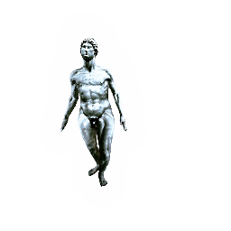
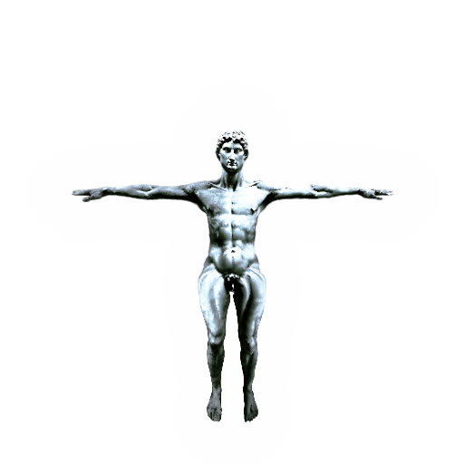

<p align="center">
  <h1>AvatarCraft: Transforming Text into Neural Human Avatars with Parameterized Shape and Pose Control</h1>
</p>


<p align="center">
  <h2><a href="https://avatar-craft.github.io/">Website</a> | <a href="https://arxiv.org/abs/2303.17606">Arxiv</a> | <a href="https://www.youtube.com/watch?v=aB4h6_WmW5s">Video</a> | <a href="https://drive.google.com/drive/folders/1fKosS6JfidXF-XO8ai15Qb18KpKzQQ5q?usp=sharing">Data</a></h2>
</p>


## Abstract
<p align="justify">
Neural implicit fields are powerful for representing 3D scenes and generating high-quality novel views, but it re mains challenging to use such implicit representations for creating a 3D human avatar with a specific identity and artistic style that can be easily animated. Our proposed method, AvatarCraft, addresses this challenge by using diffusion models to guide the learning of geometry and texture for a neural avatar based on a single text prompt. We care fully design the optimization of neural implicit fields using diffusion models, including a coarse-to-fine multi-bounding box training strategy, shape regularization, and diffusion- based constraints, to produce high-quality geometry and texture. Additionally, we make the human avatar animatable by deforming the neural implicit field with an explicit warping field that maps the target human mesh to a template human mesh, both represented using parametric human models. This simplifies the animation and reshaping of the generated avatar by controlling pose and shape parameters. Extensive experiments on various text descriptions show that AvatarCraft is effective and robust in creating human avatars and rendering novel views, poses, and shapes.
<p>

[**Update**] :fire: Jun 2022: Code for avatar creation and articulation is released. 


## Environment Setup
Use Conda to create a virtual environment and install dependencies:
```
conda create -n avatar python=3.7 -y;
conda activate avatar;
conda install pytorch==1.8.0 torchvision==0.9.0 cudatoolkit=10.2 -c pytorch;
# For GPU with CUDA version 11.x, please use:
# conda install pytorch==1.8.0 torchvision==0.9.0 torchaudio==0.8.0 cudatoolkit=11.1 -c pytorch -c conda-forge
conda install -c fvcore -c iopath -c conda-forge fvcore iopath;
conda install -c bottler nvidiacub;
conda install pytorch3d -c pytorch3d;
conda install -c conda-forge igl;
pip install opencv-python joblib open3d imageio==2.25.0 tensorboardX chumpy  scikit-image ipython matplotlib einops trimesh pymcubes;
pip install diffusers==0.16.1 transformers==4.29.1;
mkdir data
mkdir ckpts
```
## Data Setup
[**Compulsory**] Register and download the [SMPL](https://smpl.is.tue.mpg.de/) model, put it under `./data` path:
```
data
  |-- smplx
      |-- smpl
            |-- SMPL_NEUTRAL.pkl
```


[**Compulsory**] Create an access token on [Huggingface](https://huggingface.co/settings/tokens) for accessing the pretrained diffusion model. Use the token to login with the following command:
```
huggingface-cli login
```

[**Compulsory**] Download our pretrained [bare SMPL ckpt](https://drive.google.com/file/d/1GRfc9fbiBLTqEP6dURaReyERT-Tzk127/view?usp=share_link), and put it into `./ckpts` path.


<p align="justify">
[**Optional**] If you would like to animate the generated avatar, you need a sequence of SMPL poses. In our project, we use [AMASS](https://amass.is.tue.mpg.de/) dataset (SMPL+H) to generate the poses. Specifically, we have used the SFU subset in our paper and video. We can't redistribute the dataset, but we provide a [script](utils/convert_amass.py) to for you to convert the AMASS format to ours. You need to download and process by yourself. Alternatively, you may also use your own SMPL pose sequence.
</p>

## Avatar Creation
<p align="justify">
Use the following command to create an avatar with text prompt. We test our code on A100-80G and RTX3090-24G, if you encounter OOM error, please reduce the batch size. For the prompt, our suggestion is that you provide as detailed description as possible. Otherwise you may not get reasonable result due to the high variance of SDS loss. 
</p>

Note: for the first time running, it will take a while to compile the CUDA operators, do not kill the process.

```
python stylize.py --weights_path "ckpts/bare_smpl.pth.tar" --tgt_text "Hulk, photorealistic style" --exp_name "hulk" --batch_size 4096
```

After creation, you can render the canonical avatar with the following command. If you don't want to train your own, you can also use our generated [avatars](https://drive.google.com/drive/folders/1t31_QK6mV9dJyCRc4VMLNJ6q0c3NQX7Q?usp=share_link):
```
python render_canonical.py --weights_path path/to/generated_avatar.pth.tar --exp_name "hulk" --render_h 256 --render_w 256
```

## Avatar Articulation
<div style="display: flex; justify-content: center;">
  
  
</div>

Once you have generated the canonical avatar, you can articulate it with the SMPL parameters. 

For animation, use the following command, where `--poseseq_path` is the path to the pose sequence processed by our [script](utils/convert_amass.py).
```
python render_wrap.py --weights_path path/to/generated_avatar.pth.tar --exp_name "hulk" --render_type animate --render_h 256 --render_w 256 --poseseq_path path/to/pose_sequence.pkl
```

For reshaping, use the following command. Specifically, the following script interpolate the betas between two avatars. In the script we hardcoded to control the second principal component of the betas (BMI) like the gif. You can change the control to be any other principal component(s) by passing the corresponding betas to `--shape_from_path` and `--shape_to_path`. 

```
python render_wrap.py --weights_path path/to/generated_avatar.pth.tar --exp_name "hulk" --render_type interp_pose --render_h 256 --render_w 256 --shape_from_path optional\betas.pkl --shape_to_path optional\betas2.pkl
```


## Citation
If you find our work useful in your research, please consider citing:
```
@article{jiang2023avatarcraft,
  title={AvatarCraft: Transforming Text into Neural Human Avatars with Parameterized Shape and Pose Control},
  author={Jiang, Ruixiang and Wang, Can and Zhang, Jingbo and Chai, Menglei and He, Mingming and Chen, Dongdong and Liao, Jing},
  journal={arXiv preprint arXiv:2303.17606},
  year={2023}
}
```