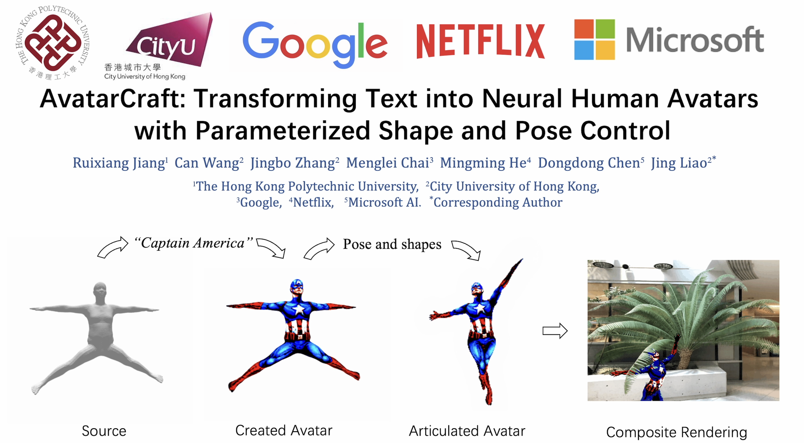

# AvatarCraft

## [Website](https://avatar-craft.github.io/)| [Arixv](https://arxiv.org/abs/2303.17606) | [Video](https://www.youtube.com/watch?v=aB4h6_WmW5s)

## Abstract
Neural implicit fields are powerful for representing 3D scenes and generating high-quality novel views, but it re mains challenging to use such implicit representations for creating a 3D human avatar with a specific identity and artistic style that can be easily animated. Our proposed method, AvatarCraft, addresses this challenge by using diffusion models to guide the learning of geometry and texture for a neural avatar based on a single text prompt. We care fully design the optimization of neural implicit fields using diffusion models, including a coarse-to-fine multi-bounding box training strategy, shape regularization, and diffusion- based constraints, to produce high-quality geometry and texture. Additionally, we make the human avatar animatable by deforming the neural implicit field with an explicit warping field that maps the target human mesh to a template human mesh, both represented using parametric human models. This simplifies the animation and reshaping of the generated avatar by controlling pose and shape parameters. Extensive experiments on various text descriptions show that AvatarCraft is effective and robust in creating human avatars and rendering novel views, poses, and shapes.

## Code
To be released soon.
